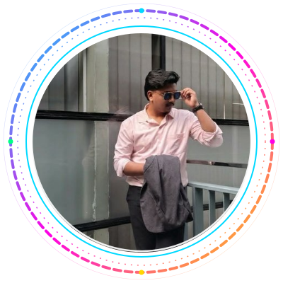

<h2>Hi there, I'm Shahdat 👋</h2>

<picture>
  <source media="(prefers-color-scheme: dark)" srcset="https://readme-typing-svg.demolab.com?font=Fira+Code&size=22&duration=3000&pause=1000&color=00D9FF&center=true&vCenter=true&width=650&lines=Aspiring+Software+Engineer;Computer+Science+Undergraduate;AI+%26+Robotics+Enthusiast;Blockchain+Research+Enthusiast;Full-Stack+Developer" />
  <source media="(prefers-color-scheme: light)" srcset="https://readme-typing-svg.demolab.com?font=Fira+Code&size=22&duration=3000&pause=1000&color=1f2937&center=true&vCenter=true&width=650&lines=Aspiring+Software+Engineer;Computer+Science+Undergraduate;AI+%26+Robotics+Enthusiast;Blockchain+Research+Enthusiast;Full-Stack+Developer" />
  
</picture>

  &nbsp;
  &nbsp;
  &nbsp;
  &nbsp;

  
  

## 🚀 About Me

I'm a **Computer Science undergraduate** passionate about **AI, Robotics, and Blockchain**, with a strong foundation in **DSA, C/C++, Java, and Full-Stack Development**. I'm eager to be part of the next big wave of tech innovation — building solutions that matter and learning relentlessly along the way.

- 🔭 Currently working on **innovative web apps and AI/ML projects**
- 🌱 Learning **Advanced DSA, System Design, and Blockchain Development**
- 👯 Looking to collaborate on **open-source projects and competitive programming**
- 💬 Ask me about **DSA, Full-Stack Dev, AI, Robotics & Blockchain**
- 📫 Reach me on **[LinkedIn](https://www.linkedin.com/in/sahadat34/)**
- ⚡ Fun fact: **When I'm not coding, you'll find me on the cricket field! 🏏**

## 🛠️ Tech Stack

#### Core Strengths

  
  
  
  
  
  

#### Languages

#### Frontend

#### Backend & Databases

#### AI / ML / Data

#### Tools & DevOps

#### Areas of Interest

  
  
  

## 📊 GitHub Stats

  

  
  

  
  

  

  

## 🏆 GitHub Trophies

  

## 📌 Featured Project

### 💬 Discord Chat System

A real-time chat application built with modern web technologies — featuring multi-user messaging, channel-based communication, and a clean, Discord-inspired UI.

  
  

&nbsp;

## 🌐 Connect With Me

## 💻 Competitive Programming

## 🎯 2025 Goals

| 🏆 Academic Excellence | 💻 Technical Growth | 🌟 Professional Development |
| :---: | :---: | :---: |
| Master Advanced Algorithms | Open-Source Contributions | Industry Networking |
| Research Publications | Full-Stack Mastery | Internship Opportunities |
| Academic Competitions | AI/ML Project Portfolio | Tech Community Speaking |
| Maintain High GPA | System Design Skills | Leadership Roles |

## 🏏 Beyond Code

When I'm off the keyboard, I'm on the **cricket pitch**. The game has shaped how I approach engineering — *consistency over flashes, strategy over reaction, and never folding when the chase looks impossible.* Every line of code I write carries a bit of that mindset.

## 💡 Philosophy

> *"The best way to predict the future is to create it."* — **Peter Drucker**

**My Mission:** To leverage technology as a force for positive change — creating innovative solutions that bridge the gap between human needs and technological possibilities.

### 🌟 *Code with Purpose, Build with Passion* 🌟

⚡ **Always learning, always growing, always coding!** ⚡

Made with ❤️ by Shahdat Hossain Emon &nbsp;•&nbsp; design polished with a nod to my friend Mohabbat's profile

